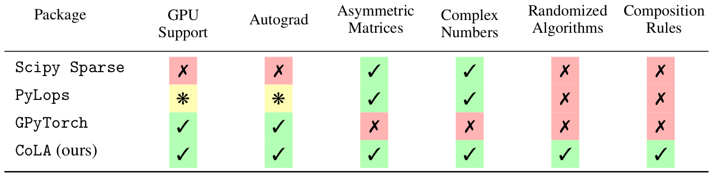

Compositional Linear Algebra (CoLA)
===================================

*CoLA  is a multiplatform framework that enables fast linear algebra operations with support for GPU acceleration and autograd.
Want to efficiently compute eigenvalues, a matrix inverse, a log determinant, or some other matrix operation, in a framework that supports both JAX and PyTorch? If your matrix has structure -- say it has sparsity or can be decomposed as a Kronecker product -- then even better.
Read on to find out more.*

Introduction
------------
Many areas of machine learning (ML) and science involve large-scale linear algebra problems,
such as performing eigendecompositions, solving linear systems, computing matrix exponentials,
and doing trace estimation.
The linear ops involved often have Kronecker, convolutional, block diagonal, sum, or product structure.
Yet, to exploit this structure, that is, in order to use specific algorithms that
have faster runtimes than general algorithms, a user must manually implement these efficient routines on
a case-by-case basis and be familiar with the different algorithms that exist for
different structures. This process leads to a notorious implementation bottleneck!

To eliminate this bottleneck we introduce ``CoLA``, a numerical linear algebra library designed to
automatically exploit the structure present in a diverse set of linear ops.
To achieve this, ``CoLA`` automatically exploits compositional structure by leveraging over 70 dispatch
rules which select different algorithms for the diverse structure present in a linear
operator. Additionally, given our emphasis on ML applications, ``CoLA`` also
supports both ``PyTorch`` and ``JAX``, leverages GPU and TPU acceleration, supports low
precision, provides automatic computation of
gradients, diagonals, transposes and adjoints of linear
ops, and incorporates specialty algorithms such as SVRG and a novel
variation of Hutchinson's diagonal estimator which exploit the large-scale sum
structure of several linear ops found in ML applications.

Furthermore, regardless of whether there is structure that can be exploited or not,
``CoLA`` can be used as a general purpose numerical linear algebra package
for large-scale linear ops.
``CoLA`` provides an implementation of classical iterative algorithms for
solving linear systems, performing eigendecompositions and more for
PSD, symmetric, non-symmetric, real and complex linear ops.

Below we highlight some of the important features that ``CoLA`` has and how they
compare with alternatives.

Installation
------------
We recommend installing via ``pip``:

.. code-block:: bash

    pip install cola-ml

To install locally instead, clone the repository and install via ``pip``:

.. code-block:: bash

    git clone https://github.com/wilson-labs/cola
    cd cola
    pip install -e .

``CoLA`` requires Python >= 3.10

The installation requires ``PyTorch`` or ``JAX`` to be installed,
 and these requirements will not be installed automatically.
If ``JAX`` is not installed, ``CoLA``  can also use a ``Numpy`` backend for most operations,
excluding advanced features like automatic differentiation and GPU support, vmap, jit, and autograd transposes.

Design Choices
--------------
``CoLA`` is designed with the following criteria in mind:

* We enable easy extensibility by allowing users to define dispatch rules and linear
  ops.
* We adhere to the same API used for dense matrix operations.
* We use multiple dispatch to exploit structure of a linear operator.
* We provide support for both PyTorch and JAX.
* We leverage automatic differentiation to define operations like transpose but also to
  derive gradients of linear ops.

.. toctree::
   :maxdepth: 1
   :caption: 🌱 Getting Started

   notebooks/About.ipynb
   notebooks/Quick_Start.ipynb

.. toctree::
   :maxdepth: 1
   :caption: 🧰 Basic Functionality

   notebooks/Linalg_operations_walkthrough.ipynb
   notebooks/Adding_Linear_Operators.ipynb
   notebooks/01_algorithms.ipynb
   notebooks/Device_Allocation.ipynb

.. toctree::
   :maxdepth: 0
   :caption: 💡 Example Applications

   notebooks/03_GPs.ipynb
   notebooks/07_second_order_optimization.ipynb
   notebooks/09_hessian_spectrum.ipynb
   notebooks/05_Boundary_Value_PDEs.ipynb
   notebooks/06_PDE_Eigenvalue_Problems.ipynb
   notebooks/04_Spectral_Clustering.ipynb

.. toctree::
   :maxdepth: 1
   :caption: 🧙‍♂️ Advanced Features

   notebooks/10_vmap_jit_grad.ipynb

.. toctree::
   :glob:
   :maxdepth: 1
   :caption: 📚 API Reference

   package/cola.linalg
   package/cola.ops
   package/cola.linear_operators
   package/cola.decompositions
   package/cola.fns
   package/cola.annotations

.. toctree::
   :maxdepth: 1
   :caption: ✨ Research Highlight

.. toctree::
   :maxdepth: 1
   :caption: 🚧 Tricky Bits 🚧

   notebooks/tricky_bits.ipynb

.. toctree::
   :maxdepth: 1
   :caption: 👩‍💻 Developer Documentation

   contributing.md

Indices and tables
==================

* :ref:`genindex`
* :ref:`modindex`
